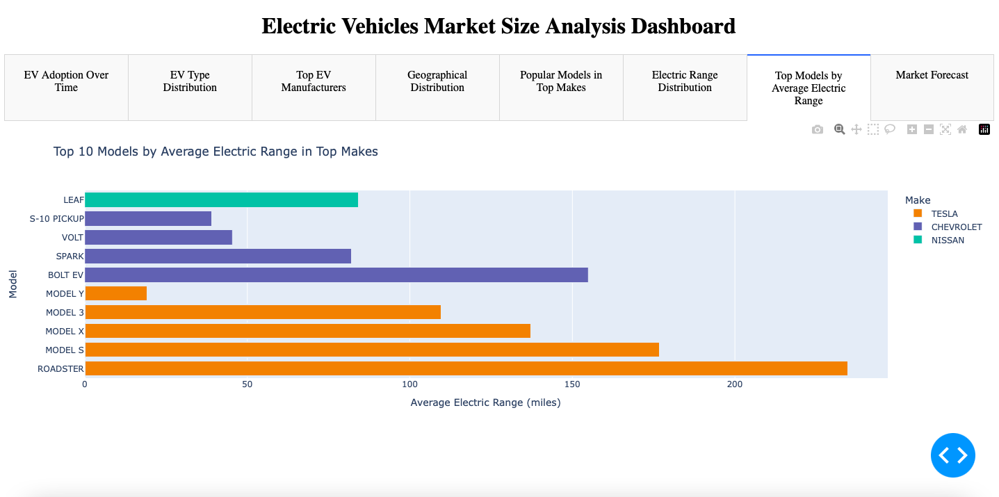

# Electric Vehicles Market Size Analysis Dashboard

## Overview
This project is a Dash-based interactive dashboard for analyzing the electric vehicle (EV) market size. The dashboard provides insights into various aspects of the EV market, including adoption trends, type distribution, geographical distribution, popular models, electric range analysis, and market forecasts.



## Features
- **EV Adoption Over Time**: Visualizes the number of EVs adopted each year.
- **EV Type Distribution**: Displays the distribution of different types of EVs.
- **Top EV Manufacturers**: Highlights the top 10 EV manufacturers based on the number of vehicles.
- **Geographical Distribution**: Shows the top cities and counties with the highest EV registrations.
- **Popular Models in Top Makes**: Lists the most popular models from the top 3 manufacturers.
- **Electric Range Distribution**: Analyzes the distribution of EV ranges with a mean indicator.
- **Top Models by Average Electric Range**: Displays the top 10 EV models with the highest average range in the top makes.
- **Market Forecast**: Projects future EV registrations based on historical data using exponential growth modeling.

## Installation

1. Clone this repository:
   ```bash
   git clone <repository_url>
   ```

2. Navigate to the project directory:
   ```bash
   cd <repository_directory>
   ```

3. Install the required dependencies:
   ```bash
   pip install -r requirements.txt
   ```

4. Place the `Electric_Vehicle_Data.csv` file in the project directory.

5. Run the application:
   ```bash
   python app.py
   ```

6. Open the app in your browser at `http://127.0.0.1:8050/`.

## File Structure
- `app.py`: Main application script for the dashboard.
- `Electric_Vehicle_Data.csv`: Dataset used for analysis.
- `requirements.txt`: List of Python dependencies.
- `Screenshot 2025-01-23 at 9.05.01 AM.png`: Example screenshot of the dashboard.

## Dataset
The dataset `Electric_Vehicle_Data.csv` includes information about EVs, such as:
- Vehicle Identification and Registration: Includes VIN (partial), vehicle ID, registration details (county, city, state, postal code), and legislative district.
- Vehicle Specifications: Covers model year, make, model, electric vehicle type (e.g., BEV, PHEV), and electric range (miles in electric mode).
- Pricing and Eligibility: Displays the manufacturer's suggested retail price (MSRP) and eligibility for Clean Alternative Fuel Vehicle (CAFV) programs.
- Geographical Data: Provides vehicle location coordinates and census tract data from the 2020 census.
- Electric Utility: Indicates the name of the electric utility provider associated with the vehicle's registration.

## How It Works

1. **Data Preparation**:
   - Missing values are removed to ensure clean data.
   - Data is grouped and aggregated for specific analyses, such as electric range trends and top models.

2. **Visualization**:
   - Dash and Plotly are used to create interactive and visually appealing graphs.
   - Tabs are implemented to separate different insights.

3. **Forecasting**:
   - Historical registration data is used to fit an exponential growth model.
   - Future registrations are forecasted for the next 6 years.

## Future Enhancements
- Add filtering options for geographical regions and manufacturers.
- Include real-time data updates.
- Provide downloadable reports.

## License
This project is licensed under the MIT License. See the LICENSE file for details.

## Contributing
Feel free to open issues or submit pull requests for improvements and bug fixes.

